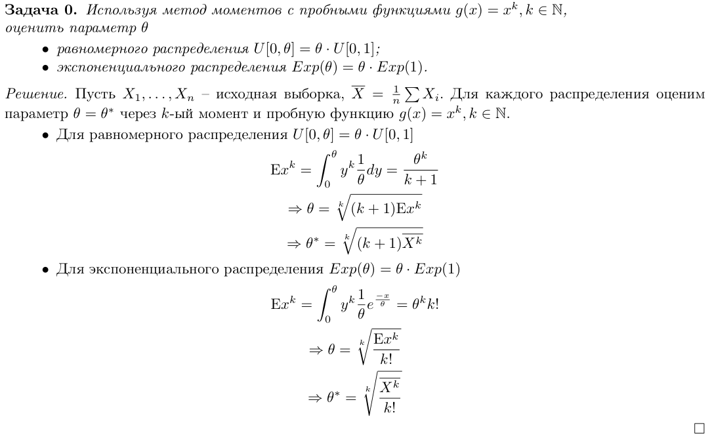
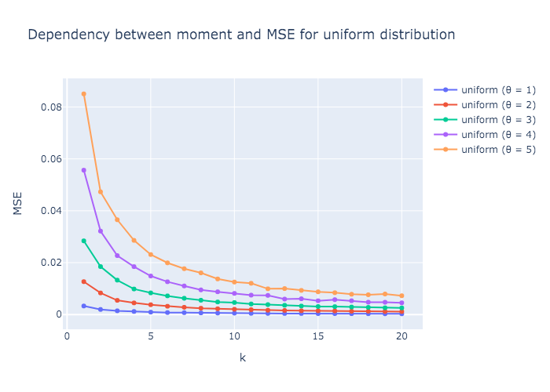
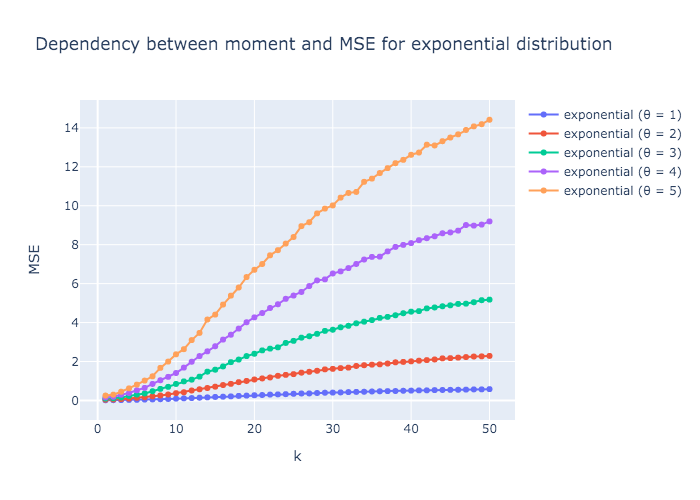

# Assignment 1

Численно исследуйте поведение среднеквадратичного отклонения (СКО) построенных оценок:
1. Генерируете выборку из нужного распределения
2. Оцениваете параметр
3. Считаете отклонение оценки от параметра
4. Повторяете это много раз
5. Получаете оценку СКО
6. Строите график зависимости СКО от `k`

В этом задании проверяется код, разумность и качество поставленного эксперимета,
а также выводы, которые можно сделать из этого эксперимента.

Прислать ссылочку на репозиторий, в котором должен лежать код и отчет.
В отчет положить описание эксперимента и результатов, картинки и выводы.

## Предварительные вычисления

## Анализ зависимости СКО от величины момента

**Вывод**: Для более точной оценки параметра с помощью метода моментов для равномерного распределения
лучше использовать более высокий момент. Однако, начиная с определённого значения, среднеквадратичное отклонение оценки от истинного
параметра всё равно выходит на плато. Поэтому нет смысла брать очень большие значения,
серия экспериментов показала, что оптимальный момент ‒ 20-30.

**Вывод**: Для экспоненциального распределения всё наоборот. Чем выше момент, тем больше СКО оценки от параметра.
Причём, чем выше параметр, тем быстрее растёт ошибка. Оптимальный момент в этом распределении ‒ 1.